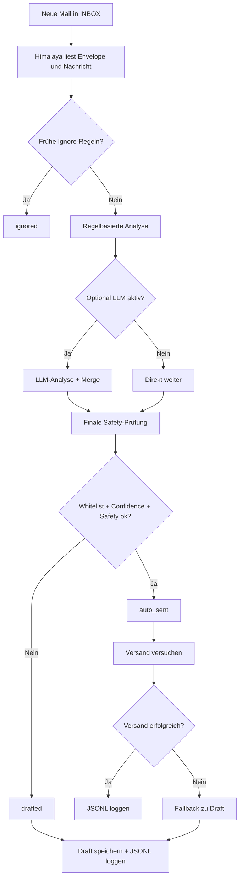

# mail-auto-draft

[](https://github.com/jozrftamson/mail-auto-draft/releases)
[](https://github.com/jozrftamson/mail-auto-draft)
[](#voraussetzungen)
[](#voraussetzungen)
[](#lizenz)

Automatische E-Mail-Triage und sichere Auto-Replies mit Himalaya, Python und optionalem `systemd --user`-Timer.

Das Projekt liest neue E-Mails aus der INBOX, klassifiziert sie regelbasiert, erstellt Antworten auf Basis von Reply-Templates und sendet nur dann automatisch, wenn die Nachricht sicher genug ist. Unklare, individuelle oder sensible Fälle werden in den Draft-/Review-Pfad gelenkt.

## Projektüberblick

`mail-auto-draft` ist für lokale, kontrollierte Mail-Automatisierung gedacht. Der Workflow ist bewusst defensiv aufgebaut:

- neue Nachrichten aus der INBOX lesen
- irrelevante System-/Newsletter-Mails früh ignorieren
- sichere Standardfälle automatisch beantworten
- riskante oder unklare Fälle als Draft behalten
- Self-Reply-Loops verhindern
- Entscheidungen nachvollziehbar loggen

## Features

- liest neue E-Mails aus der INBOX via Himalaya
- priorisiert `Reply-To` vor `From`
- verhindert Self-Reply-Loops über `own_addresses`
- blockiert typische `no-reply`-, Bulk-, Newsletter- und Systemmails
- beantwortet einfache Standardfälle automatisch
- fällt bei Unsicherheit oder Sendefehlern auf Draft zurück
- protokolliert jede Entscheidung in JSONL
- lässt sich optional per `systemd --user` Timer dauerhaft ausführen
- unterstützt optional eine LLM-Erweiterung zusätzlich zur Regel-Logik

## Einsatzfälle

- Eingangsbestätigungen
- Termin- oder Info-Anfragen
- lokale Mail-Automatisierung auf Ubuntu/Linux
- kleine bis mittlere Auto-Reply-Workflows mit Sicherheitsfokus

## Architektur



## Projektstruktur

```text
.
├── process_inbox.py
├── config.example.yaml
├── prompts/
│   ├── system_prompt.txt
│   └── user_prompt.txt
├── deploy/systemd/
│   ├── mail-auto-draft.service
│   ├── mail-auto-draft.timer
│   └── README.md
├── SCHNELLSTART_AND_INSTALLATION.md
├── RELEASES_AND_TAGS.md
├── CHANGELOG.md
└── CONTRIBUTING_AND_HERMES_SKILL.md
```

Wichtig:

- `config.example.yaml` ist die Repo-Vorlage
- `config.yaml` ist nur für lokale Nutzung gedacht und sollte nicht committed werden

## Voraussetzungen

- Linux / Ubuntu
- Python 3
- [Himalaya](https://github.com/pimalaya/himalaya)
- ein funktionierender Himalaya-Account für IMAP/SMTP

Python-Abhängigkeiten:

```bash
python3 -m pip install --user pyyaml requests
```

## Schnellstart

1. Repository klonen.
2. Himalaya installieren und mit deinem Mailkonto konfigurieren.
3. Beispielkonfiguration kopieren:

```bash
cp config.example.yaml config.yaml
```

4. `config.yaml` anpassen, besonders:
   - `account`
   - `own_addresses`
   - `paths`
   - `whitelist_categories`
   - `confidence_threshold`
   - `safety.*`

5. Syntax prüfen:

```bash
python3 -m py_compile process_inbox.py
```

6. Erst im Draft-Modus testen:

```bash
python3 process_inbox.py --mode draft --limit 5
```

7. Erst danach Auto-Modus testen:

```bash
python3 process_inbox.py --mode auto --limit 1
```

## Konfiguration: Repo vs. Local sauber trennen

Empfohlene Trennung:

- `config.example.yaml`:
  sichere, veröffentlichbare Beispielkonfiguration im Repo
- `config.yaml`:
  lokale Arbeitskonfiguration, nicht committen
- Himalaya-Secrets:
  außerhalb des Repos halten, z. B. in `~/.config/mail-auto-draft/secrets.env`

Empfohlener lokaler Setup:

```bash
cp config.example.yaml config.yaml
```

Dann in `config.yaml` ersetzen:

- `your-himalaya-account`
- `your-address@example.com`
- `__PROJECT_DIR__`

## Wichtige Sicherheitsprinzipien

Empfohlene Produktionseinstellungen:

- `require_unseen: true`
- `require_new_in_inbox: true`
- `require_whitelist: true`
- `require_high_confidence: true`
- `own_addresses` korrekt gesetzt
- `unklar`, `individuell`, `sensibel` und `ignorieren` nicht automatisch senden

Warum `own_addresses` wichtig ist:

Wenn die eigene E-Mail-Adresse nicht gesetzt ist, kann das System auf eigene gesendete oder zurücklaufende Nachrichten antworten und Schleifen erzeugen.

Beispiel:

```yaml
own_addresses:
  - your-address@example.com
```

## Konfigurationslogik auf einen Blick

Wichtige Kategorien:

- `info_standard`
- `termin_standard`
- `unterlagen_standard`
- `eingangsbestaetigung`
- `individuell`
- `sensibel`
- `unklar`
- `ignorieren`

Typischer sicherer Ablauf:

- irrelevante/System-/Newsletter-Mails => `ignored`
- unklare oder riskante Mails => `drafted`
- nur whitelisted + ausreichend sichere Fälle => `auto_sent`

## Logging und Nachvollziehbarkeit

Die wichtigsten Laufzeitinformationen stehen in:

- `logs/mail_actions.jsonl`

Dort findest du pro Mail unter anderem:

- `action`
- `reason`
- `chosen_reply_recipient`
- `chosen_reply_source`
- `sent`
- `draft_path`

## systemd-Hinweise

Vorlagen liegen in:

- `deploy/systemd/mail-auto-draft.service`
- `deploy/systemd/mail-auto-draft.timer`
- `deploy/systemd/README.md`

Nützliche Kommandos:

```bash
systemctl --user daemon-reload
systemctl --user enable --now mail-auto-draft.timer
systemctl --user status mail-auto-draft.timer --no-pager
systemctl --user status mail-auto-draft.service --no-pager
journalctl --user -u mail-auto-draft.service -n 50 --no-pager
```

## Bekannte Gmail-/Himalaya-Besonderheiten

Bei Gmail kann Himalaya nach erfolgreichem SMTP-Versand beim IMAP-Append in den Sent-Ordner scheitern.

Typische Meldungen sind zum Beispiel:

- `cannot add IMAP message`
- `Folder doesn't exist`

Dieses Projekt behandelt diesen Fall als wahrscheinlich erfolgreichen Versand, um Doppelversand zu vermeiden.

## Troubleshooting

### `cannot send message without a recipient`

Ursache:
- das Himalaya-Reply-Template enthält kein gültiges `To:`-Feld

Abhilfe:
- `Reply-To` bevorzugen
- sonst `From` als Fallback verwenden
- aktuelle Version des Projekts berücksichtigt diesen Fall bereits

### `cannot add IMAP message` nach erfolgreichem Versand

Ursache:
- Gmail-/Himalaya-Sent-Append-Problem

Abhilfe:
- Versand nicht sofort als Totalfehler interpretieren
- Logs prüfen
- Doppelversand vermeiden

### Eigene Mails werden erneut beantwortet

Ursache:
- `own_addresses` fehlt oder ist falsch gesetzt

Abhilfe:
- eigene Adresse in `config.yaml` eintragen
- danach erneut testen

### Newsletter werden nicht ignoriert, sondern nur gedraftet

Ursache:
- Filter greifen nicht früh genug, Mail landet als `unklar`

Abhilfe:
- `sender_substrings_*`, Header-Ignore-Regeln und Subject-/Body-Muster erweitern
- neue Log-Einträge prüfen, ob `ignored` statt `drafted` erreicht wird

## Nicht ins Repository committen

Nicht versionieren:

- `config.yaml`
- `logs/`
- `drafts/`
- `data/`
- `runtime/`
- lokale Secrets
- maschinenspezifische Overrides

Für die Weitergabe auf GitHub gilt:

- keine echten Zugangsdaten committen
- nur `config.example.yaml` als Vorlage veröffentlichen
- lokale Runtime-Daten nicht einchecken
- systemd-Vorlagen mit Platzhaltern beilegen

## Weitere Dokumentation

- [Schnellstart und Installation](./SCHNELLSTART_AND_INSTALLATION.md)
- [Releases und Tags](./RELEASES_AND_TAGS.md)
- [Changelog](./CHANGELOG.md)
- [Contributing / Hermes Skill](./CONTRIBUTING_AND_HERMES_SKILL.md)
- [systemd Deployment Notes](./deploy/systemd/README.md)

## Repository-Status prüfen

```bash
git status
python3 -m py_compile process_inbox.py
```

## Lizenz

Der Lizenzstatus ist projektspezifisch zu ergänzen, falls das Repository öffentlich verteilt wird.
